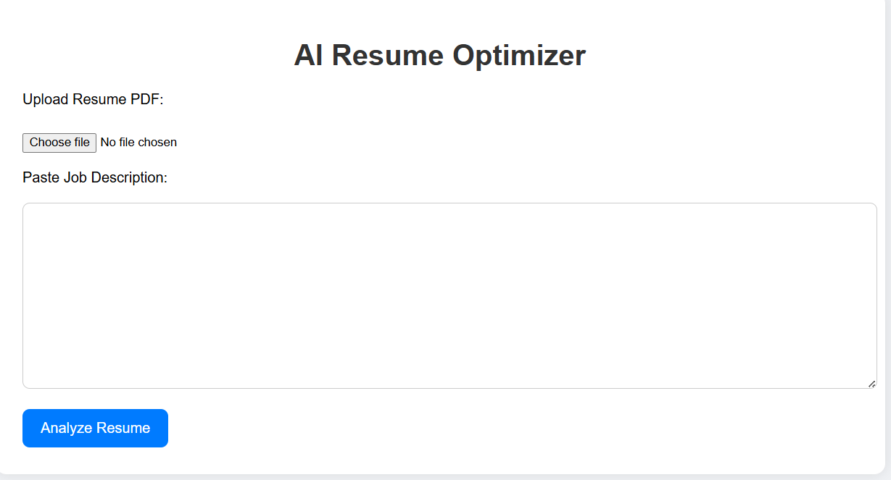
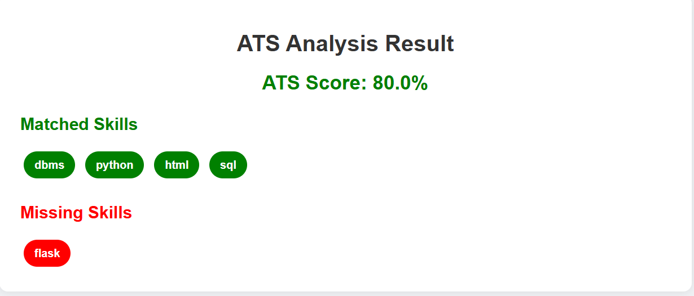

# AI Resume Optimizer

This project is a simple Resume Optimizer web application developed using Python, Flask, HTML, and CSS. It helps users check how well their resume matches a job description by calculating an ATS score and identifying matching and missing skills.

## Features

* Upload resume in PDF format
* ATS score calculation
* Skill matching and missing skills detection
* Smart skill mapping support
* Simple and clean user interface

## Technologies Used

* Python
* Flask
* HTML
* CSS
* PyPDF2

## How the Project Works

The user uploads a resume PDF and enters a job description. The application extracts text from the resume, compares the skills with the job description, and displays the ATS score along with matched and missing skills.

## Project Highlights

* Built using Flask framework
* Implemented PDF text extraction
* Added skill mapping logic such as MySQL to SQL matching
* Created frontend using HTML and CSS
* Added color-based result display

## Run the Project

Install required libraries:

pip install flask PyPDF2

Run the application:

python app.py

## Future Improvements

* Add database support
* Improve ATS matching logic
* Add login and user history
* Enhance frontend design
                                                         ## Screenshots

### Home Page

### ATS Result

